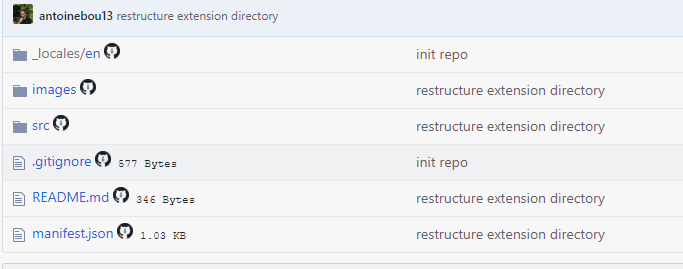
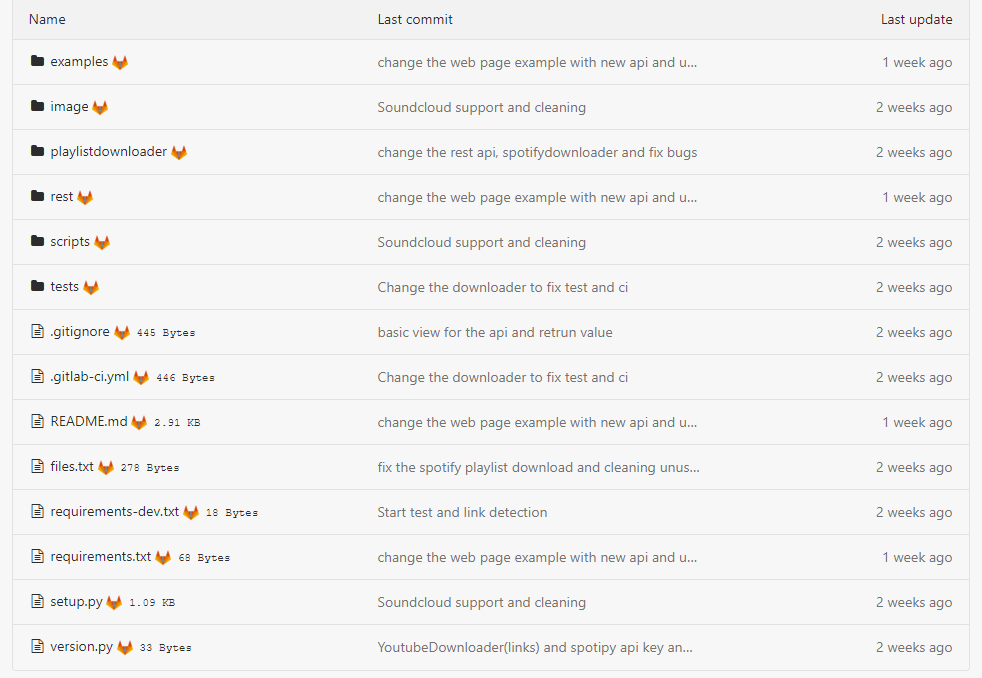
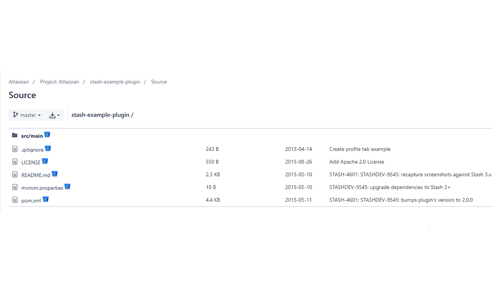

# 👨🏽‍💻 Chrome extension for Github/Gitlab/Bitbucket to download single file

This extension add a download button and the size of the file to each file to a github and gitlab repo. So you can download individual file in a repo.

For the directory they link you to the other file inside the directory.

## Github

## Gitlab

## BitBucket

## Other 

If the extension doesn't work please refresh the page or the extension(F5)

feel free to contribute 🤗
